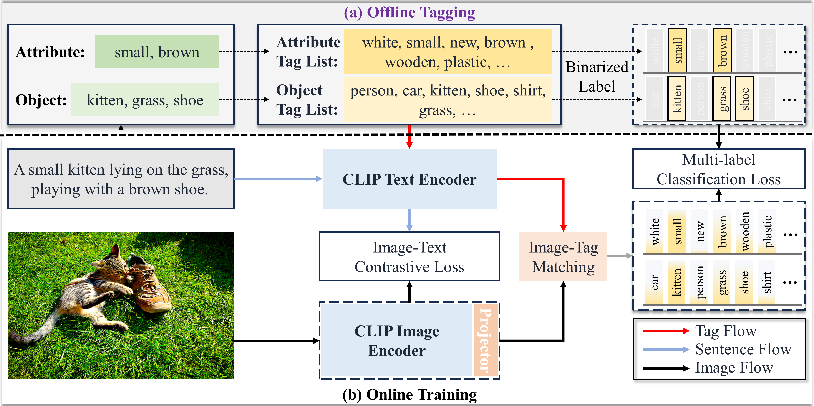

# TagAlign: Improving Vision-Language Alignment with Multi-Tag Classification

This repository is the official implementation of [TagAlign](https://arxiv.org/abs/2301.09121).

<div align="center">

</div>

## Requirements
* apex==0.1
* clip==1.0
* mmcv-full==1.4.7
* mmsegmentation==0.21.1
* torch==1.11.0

## Data Preparation
For training, we use the CC12M dataset. The researchers are encouraged to prepare CC12M dataset from the [source](https://github.com/google-research-datasets/conceptual-12m) or using [img2dataset](https://github.com/rom1504/img2dataset). The file structure should follow:

```shell
CC12M
├── 000002a0c848e78c7b9d53584e2d36ab0ac14785.jpg
├── 000002ca5e5eab763d95fa8ac0df7a11f24519e5.jpg
├── 00000440ca9fe337152041e26c37f619ec4c55b2.jpg
...
```
We provide the captions of the images in [meta_file]().

For evaluation, please follow the [mmsegmentation](https://github.com/open-mmlab/mmsegmentation/blob/master/docs/en/dataset_prepare.md) to prepare the datasets. Remember to change the image dirs in 'segmentation/configs/_base_/datasets/*.py'.

## Train and Evaluate
1. Modify the 'tagalign.yml'. We provide the pre-processed ['tag_file']() and ['label_file'](). 

2. Train the TagAlign model by run 
   ```
   torchrun --rdzv_endpoint=localhost:6000 --nproc_per_node=auto main.py --cfg configs/tagalign.yml
   ```
3. You can evaluate the TagAlign model by running the command below.
   ```
   torchrun --rdzv_endpoint=localhost:6000 --nproc_per_node=auto main.py --cfg configs/eval.yml --eval --resume $pre-trained weight path$ 
   ```


 ## References

* [GroupViT](https://github.com/NVlabs/GroupViT)
* [TCL](https://github.com/kakaobrain/tcl)
* [CLIP_Surgery](https://github.com/xmed-lab/CLIP_Surgery)
* [OVSegmentor/](https://github.com/Jazzcharles/OVSegmentor)


